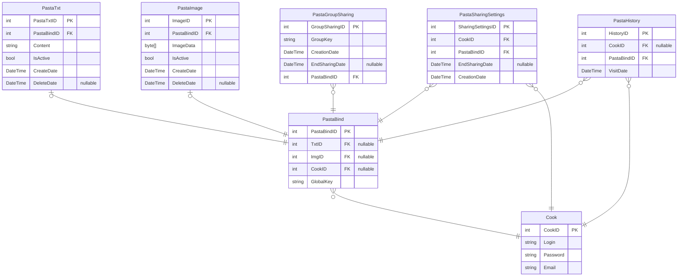

```mermaid
erDiagram
    Cook {
        int CookID PK
        string Login
        string Password
        string Email
    }

    PastaTxt {
        int PastaTxtID PK
        int PastaBindID FK
        string Content
        bool IsActive
        DateTime CreateDate
        DateTime DeleteDate "nullable"
    }

    PastaSharingSettings {
        int SharingSettingsID PK
        int CookID FK
        int PastaBindID FK
        DateTime EndSharingDate "nullable"
        DateTime CreationDate
    }

    PastaImage {
        int ImageID PK
        int PastaBindID FK
        byte[] ImageData
        bool IsActive
        DateTime CreateDate
        DateTime DeleteDate "nullable"
    }

    PastaHistory {
        int HistoryID PK
        int CookID FK "nullable"
        int PastaBindID FK
        DateTime VisitDate
    }

    PastaGroupSharing {
        int GroupSharingID PK
        string GroupKey
        DateTime CreationDate
        DateTime EndSharingDate "nullable"
        int PastaBindID FK
    }

    PastaBind {
        int PastaBindID PK
        int TxtID FK "nullable"
        int ImgID FK "nullable"
        int CookID FK "nullable"
        string GlobalKey
    }


    PastaTxt |o--|| PastaBind : ""
    PastaImage |o--|| PastaBind : ""
    PastaBind }o--|| Cook : ""

    PastaSharingSettings }o--|| PastaBind : ""
    PastaGroupSharing }o--|| PastaBind : ""
    PastaHistory }o--|| PastaBind : ""

    PastaSharingSettings }o--|| Cook : ""
    PastaHistory }o--|| Cook : ""

```