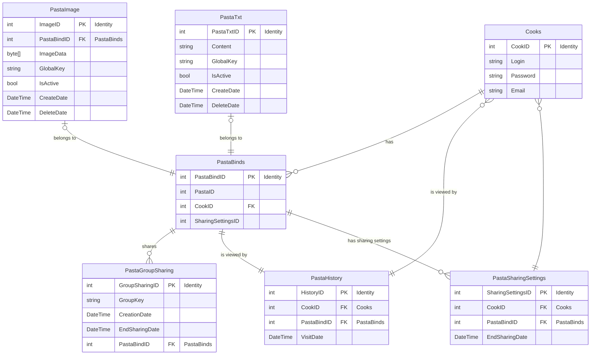

```mermaid
erDiagram
    Cooks {
        int CookID PK "Identity"
        string Login
        string Password
        string Email
    }

    PastaImage {
        int ImageID PK "Identity"
        int PastaBindID FK "PastaBinds"
        byte[] ImageData
        string GlobalKey
        bool IsActive
        DateTime CreateDate
        DateTime DeleteDate
    }

    PastaTxt {
        int PastaTxtID PK "Identity"
        string Content
        string GlobalKey
        bool IsActive
        DateTime CreateDate
        DateTime DeleteDate
    }

    PastaBinds {
        int PastaBindID PK "Identity"
        int PastaID
        int CookID FK
        int SharingSettingsID
    }

    PastaGroupSharing {
        int GroupSharingID PK "Identity"
        string GroupKey
        DateTime CreationDate
        DateTime EndSharingDate
        int PastaBindID FK "PastaBinds"
    }

    PastaHistory {
        int HistoryID PK "Identity"
        int CookID FK "Cooks"
        int PastaBindID FK "PastaBinds"
        DateTime VisitDate
    }

    PastaSharingSettings {
        int SharingSettingsID PK "Identity"
        int CookID FK "Cooks"
        int PastaBindID FK "PastaBinds"
        DateTime EndSharingDate
    }

    Cooks ||--o{ PastaBinds : "has"
    PastaBinds ||--o{ PastaGroupSharing : "shares"
    PastaBinds ||--|| PastaHistory : "is viewed by"
    PastaBinds ||--o{ PastaSharingSettings : "has sharing settings"
    PastaImage |o--|| PastaBinds : "belongs to"
    PastaTxt |o--|| PastaBinds : "belongs to"
    PastaHistory ||--O{ Cooks : "is viewed by"
    PastaSharingSettings ||--O{ Cooks : ""


```