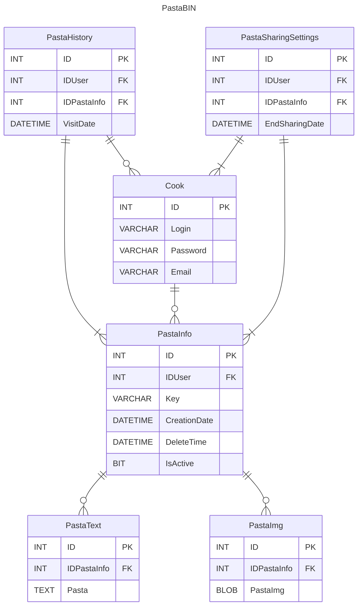

```mermaid

---
title: PastaBIN
---
erDiagram

    Cook {
        INT ID PK
        VARCHAR Login
        VARCHAR Password
        VARCHAR Email
    }
    PastaInfo {
        INT ID PK
        INT IDUser FK 
        VARCHAR Key
        DATETIME CreationDate
        DATETIME DeleteTime
        BIT IsActive
    }

    PastaImg {
        INT ID PK
        INT IDPastaInfo FK
        BLOB PastaImg
        }

    PastaText {
        INT ID PK
        INT IDPastaInfo FK
        TEXT Pasta
    }

    PastaHistory{
        INT ID PK
        INT IDUser FK 
        INT IDPastaInfo FK
        DATETIME VisitDate
    }

    PastaSharingSettings{
        INT ID PK
        INT IDUser FK 
        INT IDPastaInfo FK
        DATETIME EndSharingDate
    }

    PastaHistory ||--o{ Cook: ""
    PastaHistory ||--|{ PastaInfo: ""

    PastaInfo ||--o{ PastaText : ""
    PastaInfo ||--o{ PastaImg : ""
    Cook ||--o{ PastaInfo : ""


    PastaSharingSettings ||--|{ Cook: ""
    PastaSharingSettings ||--|{ PastaInfo: ""


```